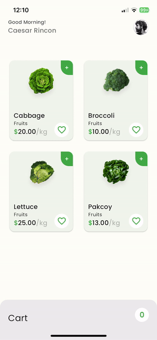
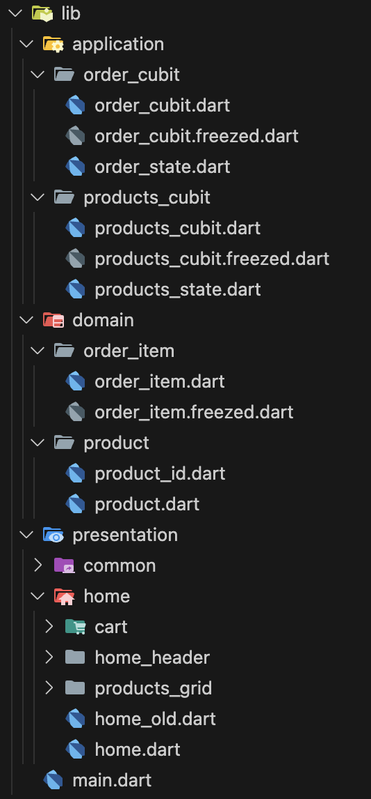

# Grocery App - Row to Column Animation

This project demonstrates how to animate widgets from a row layout to a column layout. The design is inspired by [TheFlutterWay](https://www.youtube.com/@TheFlutterWay).

## Packages Used 📦

This project utilizes several packages to enhance functionality and improve development efficiency. Below is a list of the packages used along with a brief description of each:

- **flutter_bloc** 🧱: A Flutter package that provides a predictable state management solution using the BLoC (Business Logic Component) pattern.
  
- **dartz** 🧙: A functional programming library for Dart that brings powerful functional programming constructs like Option, Either, and more.

- **freezed** ❄️: A code generation package for immutable classes, union types, and pattern matching in Dart.

- **flutter_animate** 💫: A package that provides a simple way to add beautiful animations to your Flutter applications.

## Preview

## Project File Structure
Project file structure includes 3 layers: Presentation, Application and Domain.
